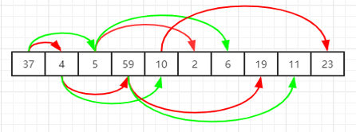

## 堆排序

堆排序是面试中常问的相关topK问题的考点，还有类似于top K问题，例如合并N个数组，链表。最高（低）出现次数统计等。

Java中的优先级队列可以作为堆来使用，默认是小根堆。可以重写Comparator来实现大根堆。

由于堆是一个完全二叉树，可以使用数组或者list来模拟实现堆。



其中红色是左节点，绿色是右节点。对于一个数组存储的树，其有子节点的值（非叶节点）的索引`0 < 1 < (nums.length >> 1-1)`的节点，。并且左节点为 `left = (root*2 + 1)`，右节点(如果存在)为`right = left + 1`。

----

```java
public class HeapSort {
    public int[] heapSort(int[] nums) {
        for (int i = nums.length; i > 0 ; i--) {
            // 构造最大堆，nums[0] 最大元素
            max_heapify(nums, i);
            //堆顶元素(最大的元素)与n-1交换，断链
            int temp = nums[0];
            nums[0] = nums[i-1];
            nums[i-1] = temp;
        }
        return nums;
    }

    private void max_heapify(int[] nums, int limit) {
        if (nums.length <= 0 || nums.length < limit) return;
        // 用数组模拟树，有子节点（非叶节点）的索引
        int parentIdx = (limit >> 1) - 1; / / 每个节点的父节点。
        for (; parentIdx >= 0; parentIdx--) {
            if(parentIdx * 2 >= limit){
                continue;
            }
            int left = parentIdx * 2 + 1;       //左子节点
            int right = (left + 1) >= limit ? left : (left + 1);    
            //右子节点，如果没有右节点，默认为左节点（方便统一处理）

            int maxChildId = nums[left] >= nums[right] ? left : right;
            if(nums[maxChildId] > nums[parentIdx]){   //交换父节点与左右子节点中的最大值
                int temp = nums[parentIdx];
                nums[parentIdx] = nums[maxChildId];
                nums[maxChildId] = temp;
            }
        }
    }
}
```